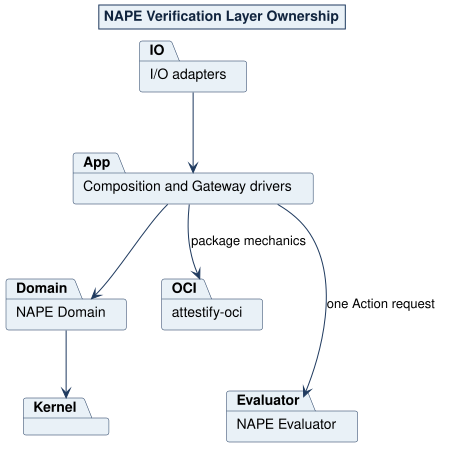

# NAPE CLI 2.0 Architecture

## Ownership

```text
NAPE CLI
  owns command parsing, definition semantics, effective occurrence graphs,
  evidence admission, Evaluator invocation, continuation, Report construction,
  Evidence Set relationships, and atomic local result persistence

attestify-oci-oss 0.1.1
  is an exact external dependency that owns domain-neutral deterministic
  package construction, PURL-to-registry mapping, OCI manifest/blob
  operations, digest and size verification, safe materialization, package
  envelope verification, custody, and Lock mechanics

NAPE Evaluator
  owns isolated execution of one prepared Test of Detail against one admitted
  evidence argument and the supplied evaluations and metadata
```

The Evaluator never receives the Procedure, package PURL, OCI endpoint,
manifest, Lock, package provenance, continuation policy, or Report identity.
`attestify-oci` never admits evidence, invokes a Test, or constructs a Report.

## Workspace

```text
apps/nape-cli/             command surface and Verification orchestration
apps/nape-cli/src/gateway_driver/definition_package_profile_attestify_oci.rs
                           NAPE-owned Verification package profile
domain/src/value/          transport-neutral bounded values
domain/src/service/        deterministic Verification semantics
domain/src/usecase/        six public orchestration seams
contracts/                generated read-only Product projections
```

The Domain's only production dependency beyond the Rust standard library is
`kernel_oss`. Parsing, serialization, hashing, files, processes, environment,
time, randomness, schemas, and OCI SDKs remain behind Application or Kernel
Gateways.

## Command flow

```text
nape package build
  -> NAPE definition admission
  -> exact caller-supplied dependency build set
  -> attestify-oci common verifier and canonical Lock construction
  -> deterministic local package result

nape package publish / resolve
  -> endpoint or exact Registry Map admission
  -> deterministic PURL mapping
  -> anonymous localhost OCI operation
  -> digest-selected common verification

nape start
  -> verified local or complete OCI Procedure closure
  -> effective Activity/Action occurrence graph
  -> subject and caller metadata admission
  -> one atomically selected collecting run

nape evidence (repeated one file at a time)
  -> one stable evidence read
  -> one definition-owned occurrence association
  -> digest-addressed payload storage and atomic add/replace

nape verify (argument-free)
  -> reopen the exact frozen current run without network access
  -> require and freeze all occurrence evidence
  -> complete Test/module/schema/resource preflight
  -> one internal Evaluator V2 or V3 call per occurrence
  -> fixed contained-result continuation
  -> Report and Evidence Set construction
  -> one sibling same-filesystem atomic rename
```

No Test executes until package resolution, semantic validation, and complete
evidence readiness finish. Verify never resolves or pulls packages again.

NAPE does not embed or vendor an OCI implementation. The CLI depends on exact
signed release tag `attestify-oci-oss` `0.1.1`, locked to commit
`64358b44b8a76b2abfd65f3ad1e043d615d4b6f6`. NAPE owns the concrete
Verification Procedure, Activity, Action, PURL, member, and dependency rules
that it supplies to the domain-neutral library.

## Registry endpoint projection

`--registry-endpoint http://localhost:<port>` is a command-local convenience
projection. The library normalizes it into the same internal `RegistryMap`
representation used by `--registry-profile`, with:

```text
scheme: http
registry: localhost:<port>
repositoryPrefix: attestify
publisher: the exact publisher parsed from each pkg:attestify PURL
```

It is not a serialized wildcard, package field, identity input, registry
search, or fallback rule. Every package in one closure uses the one configured
endpoint. The full map is required for different publisher locations.

## Evaluator selection

Definitions needing only the minimal opaque path select internal
`attestify.nape-evaluator.action-invocation/v2` and
`attestify-python-test-development-v1`. Definitions using current functional
capabilities select internal request V3 and development Runner V2. Both call:

```python
evaluate(evidence, evaluations, metadata)
```

These internal versions do not change the external Verification V2 definition
or Report version.

## Current stop boundary

The current delivery is development-qualified. It excludes authentication,
trust, package cache, Fact Finding, Risk Engine execution, outcome UI/storage,
independent runtime libraries, enterprise Runner hardening, and OCI Report
publication.



Source: [01-system-layers.puml](../assets/diagrams/plantuml/source/01-system-layers.puml)
