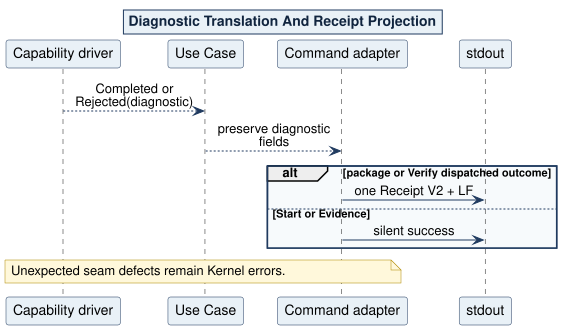

# Decision 0006: Bounded Diagnostic Outcomes

Status: accepted.

Every governed Use Case or capability result is either `Completed(value)` or `Rejected(NapeDiagnostic)`. The diagnostic retains exact code, reason-template identifier, phase, and bounded safe detail. A driver translates an `attestify-oci` or Evaluator consumer failure exactly once.

Kernel `Error` is reserved for an unavailable, internally inconsistent, or violated seam. Command adapters do not parse error strings. Package and Verify commands project dispatched outcomes into Receipt V2; successful Start and Evidence remain silent. Clap grammar errors remain exit 2 with no Receipt.

Source: [07-diagnostic-receipt.puml](../../assets/diagrams/plantuml/source/07-diagnostic-receipt.puml)
