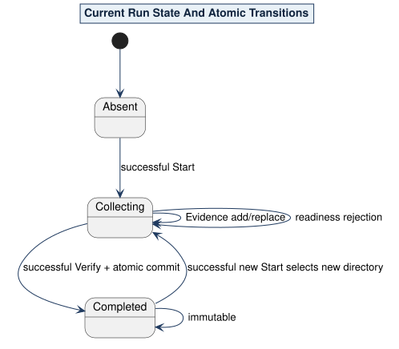

# Decision 0007: NAPE-Managed Current Verification

Status: accepted.

NAPE supports exactly one staged lifecycle: Start, repeated one-file Evidence, and argument-free Verify. A successful Start creates a distinct directory and atomically selects it as the current run. The complete versioned state freezes invocation identity, source and package custody, subject, metadata, effective graph, evidence limits, and result destination.

Evidence collection updates only the collecting run through atomic add/replace semantics. Verify performs no acquisition or remote resolution. Successful Verify commits one immutable result family. A later successful Start selects a new directory without mutating a prior completed run. There are no caller-selected run handles, concurrent-run selectors, workspaces, one-shot Verify, or output arguments.

Source: [10-current-run-state.puml](../../assets/diagrams/plantuml/source/10-current-run-state.puml)
