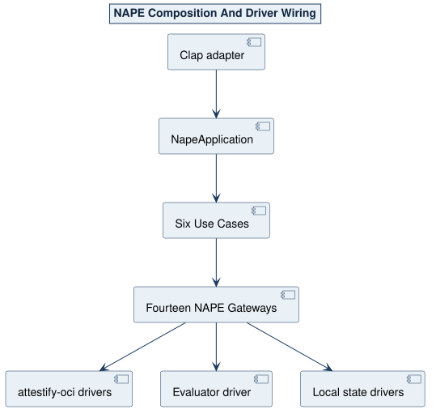

# NAPE Gateway Contracts

NAPE Domain owns fourteen capability Gateways and uses two Kernel Gateways. A Gateway carries a bounded request and observation; it never hides an entire Verification workflow.

| Gateway | Shape | Driver responsibility |
| --- | --- | --- |
| `ActionEvaluationGW` | sync process boundary | invoke one admitted Evaluator request |
| `AuthoredDefinitionSourceGW` | sync | seal one stable source inventory |
| `ControlledDocumentProjectionGW` | sync | parse controlled JSON/YAML/TOML to `ControlledValue` |
| `DefinitionPackageBuildGW` | sync | translate one admitted build to `attestify-oci` |
| `DefinitionPackagePublicationGW` | async | publish exact bytes and prove clean re-pull |
| `LocalDefinitionPackageAcquisitionGW` | sync | reopen and verify one local build |
| `OciDefinitionPackageResolutionGW` | async | acquire one exact complete closure |
| `CurrentVerificationAcquisitionGW` | sync | reopen the selected versioned run |
| `EvidenceAcquisitionGW` | sync | stable-read one regular file and digest it |
| `RestrictedSchemaValidationGW` | sync | apply the restricted schema profile |
| `VerificationOutcomeCommitGW` | sync | atomically commit the complete result family |
| `VerificationEvidenceCommitGW` | sync | atomically update one association/payload |
| `VerificationStartCommitGW` | sync | atomically select one new current run |
| `VerificationSubjectAcquisitionGW` | sync | admit one closed subject document |

`NewIdentityGW` and `CurrentUTCTimestampGW` are Kernel capabilities. Domain never reads the filesystem, environment, clock, randomness, process, parser, serializer, schema library, OCI SDK, or transport directly.

Governed capability failures return `NapeOutcome::Rejected(NapeDiagnostic)`. A driver translates a library failure once. Kernel `Error` represents unavailable or violated seams, not a Product rejection.

Source: [02-composition-wiring.puml](../assets/diagrams/plantuml/source/02-composition-wiring.puml)
