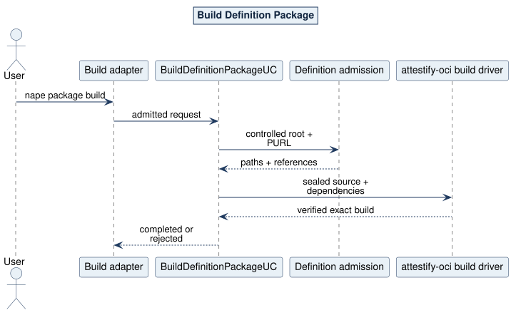

# Build Definition Package Use Case

## What and why

`BuildDefinitionPackageUC` converts one stable authored Action, Activity, or Procedure source tree into one exact verified local package result. It exists so NAPE owns Product-semantic admission while `attestify-oci` owns source sealing, canonical archive/config/manifest construction, Lock construction, and common verification.

## Request and outcome

The request contains one opaque source handle, one exact versioned `pkg:attestify` PURL, zero or more exact dependency-package handles, and one required-new output handle. Completion returns the kind, PURL plus manifest digest, Lock counts, output handle, and verified package observation. A governed package or definition failure is `Rejected`; an unavailable seam is a Kernel error.

## Flow and invariants

The source driver seals a stable file inventory. The projection driver maps the root to `ControlledValue`. Domain admission derives the exact authored paths and direct references and rejects any missing or unclassified path. Every supplied dependency is independently reopened and verified. The build driver translates the admitted request to one high-level `attestify-oci` build operation. It never searches neighboring directories or a registry.

CLI mapping: `nape package build`. Logical paths: embedded leaf, referenced leaf, referenced Activity closure, invalid root, invalid inventory, incomplete/extra dependency set, and existing output.

Source: [03-build-sequence.puml](../../assets/diagrams/plantuml/source/03-build-sequence.puml)
