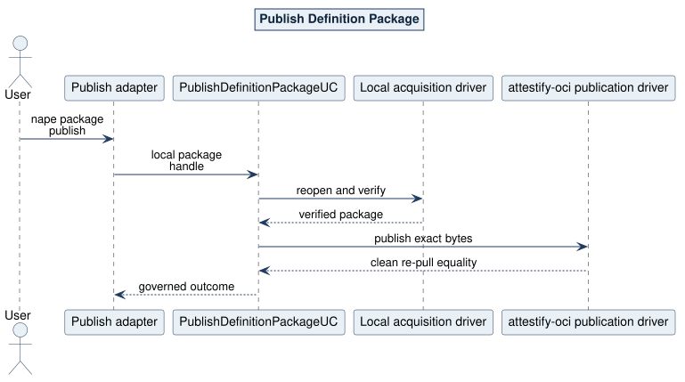

# Publish Definition Package Use Case

## What and why

`PublishDefinitionPackageUC` publishes the exact bytes of one already-built package and proves clean digest-selected re-pull equality. It cannot rebuild, reinterpret, or mutate the package.

## Request and outcome

The request contains one opaque local-package handle. Registry configuration is injected into the driver. Completion returns the verified package, exact mapped Registry location, publication disposition, `digest-verified` integrity, `not-evaluated` trust, and clean re-pull equality.

## Flow and invariants

Local acquisition first reopens the build result through the common verifier. Controlled root projection confirms the package remains semantically admissible. The publication driver uses `attestify-oci` to map the PURL, publish the exact config/archive/manifest bytes, and pull by the resulting digest. No tag is execution authority and no fallback Registry is searched.

CLI mapping: `nape package publish`. Logical paths: success, local package mutation, map rejection, transport rejection, publication conflict, and clean-repull mismatch.

Source: [04-publish-sequence.puml](../../assets/diagrams/plantuml/source/04-publish-sequence.puml)
