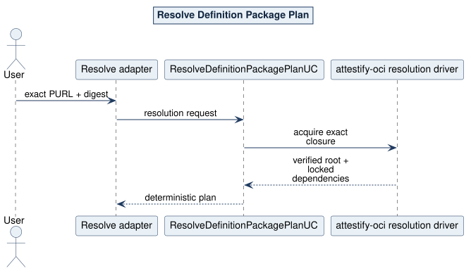

# Resolve Definition Package Plan Use Case

## What and why

`ResolveDefinitionPackagePlanUC` resolves one exact root PURL plus manifest digest into a verified package closure and deterministic dependency plan. It performs no evidence collection or execution.

## Request and outcome

The request is one `PackageReleaseIdentity`. Completion contains the verified root, canonical ordered dependency packages and Lock edges, exact mapped locations, and the Lock/profile validation observation.

## Flow and invariants

The OCI driver delegates the complete pull, digest/size/media verification, safe archive admission, Lock closure, and package verification to `attestify-oci`. Domain checks the controlled semantic roots and deterministic plan meaning. Versions are already locked; runtime does not solve versions or search registries.

CLI mapping: `nape package resolve --plan-only`. Logical paths: root-only, locked closure, PURL/digest rejection, mapping rejection, graph conflict/cycle, and package mutation.

Source: [05-resolve-sequence.puml](../../assets/diagrams/plantuml/source/05-resolve-sequence.puml)
