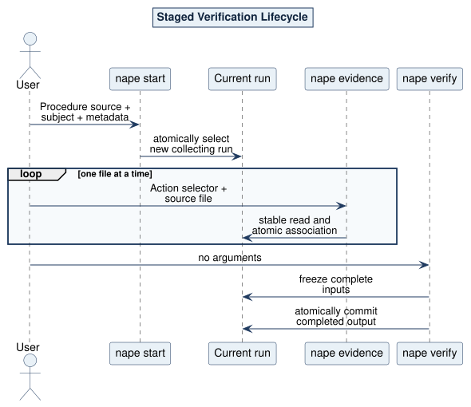

# Start Verification Use Case

## What and why

`StartVerificationUC` prepares one new staged Verification run from either an exact local build result or an exact OCI root release. It resolves and freezes all packages before evidence collection and never executes a Test.

## Request and outcome

The request contains exactly one Procedure source, one subject-file handle, and bounded caller metadata. The OCI variant carries exact PURL plus manifest digest. Completion returns the invocation identity and newly selected current-run handle; successful CLI execution is silent.

## Flow and invariants

The selected acquisition Gateway returns one verified complete closure. NAPE admits every definition, resolves the effective Activity/Action occurrence graph, admits the closed subject, creates Engine-owned time and invocation identity, and commits one complete versioned run atomically. The run stores verified package custody; later Evidence and Verify commands do not re-resolve OCI.

CLI mapping: `nape start`. Logical paths: local success, OCI success, package/subject/graph rejection, metadata rejection, new-run selection, and atomic non-promotion.

Source: [09-staged-verification.puml](../../assets/diagrams/plantuml/source/09-staged-verification.puml)
