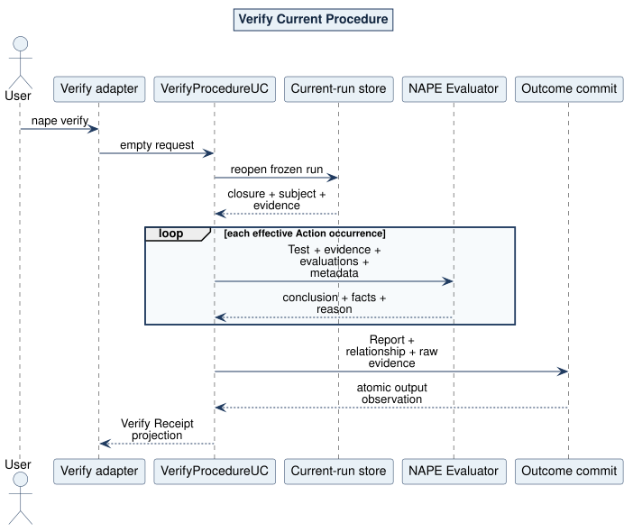

# Verify Procedure Use Case

## What and why

`VerifyProcedureUC` executes the already-prepared current Verification Procedure. Its public request is intentionally empty: the package closure, subject, metadata, and evidence were frozen by Start and Evidence.

## Request and outcome

Completion returns the invocation and fresh Report ULIDs, exact Procedure release identity, acquisition vocabulary, complete summary, unique evidence count, and atomic local commitment. Product rejections retain their Packet-4 diagnostic; unexpected seam defects remain Kernel errors.

## Flow and invariants

NAPE reopens and verifies current custody without network access, requires all occurrence evidence before Action one, preflights every Test/module/schema/resource, freezes the complete input set, and invokes the NAPE Evaluator once per effective Action occurrence. The Evaluator sees only `evaluate(evidence, evaluations, metadata)`. NAPE applies fixed continuation, aggregates conclusions, constructs the Report and Evidence Set relationship, and atomically exposes those documents plus digest-addressed raw evidence.

CLI mapping: argument-free `nape verify`. Logical paths include V2/V3 Evaluator selection, true/false/inconclusive, contained and terminal results, readiness rejection, hostile Evaluator output, exact provenance, summary equality, and output non-promotion.

Source: [06-verify-sequence.puml](../../assets/diagrams/plantuml/source/06-verify-sequence.puml)
