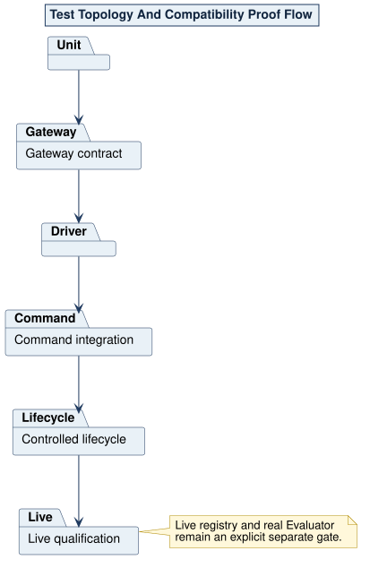

# NAPE Test Topology

Unit tests belong beside their bounded value, service, Gateway contract, driver, adapter, or composition unit in `tests.rs`. Use Case tests execute through `UseCase` or `AsyncUseCase` and the borrowed marker seam. Driver tests exercise stable external boundaries with controlled temporary roots. Command tests validate grammar, silence/Receipt behavior, exits, and current-run state. Lifecycle tests compose the real package and Evaluator boundaries. Live qualification is explicit and is not hidden inside the default test command.

Tests use `/// Requirement validation:` names, one logical path per test, a `_success`, `_success_async`, `_error`, or `_error_async` suffix, and no `unwrap`. Fallible setup may use `expect` with a specific message.

Source: [08-test-topology.puml](../assets/diagrams/plantuml/source/08-test-topology.puml)
